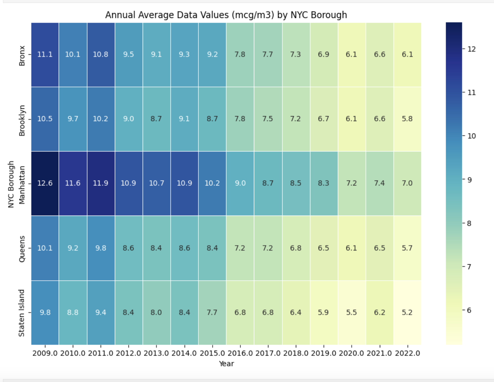
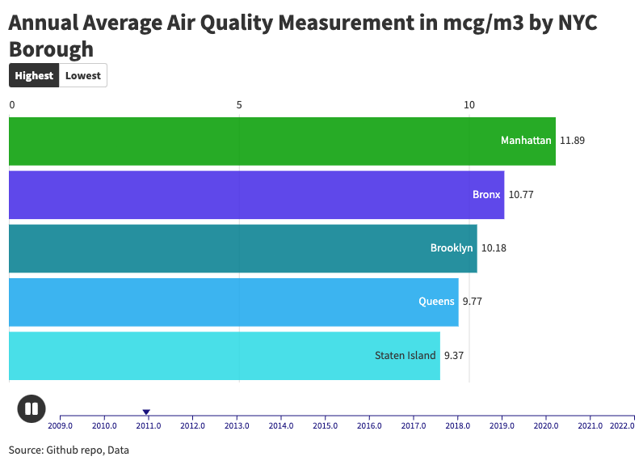
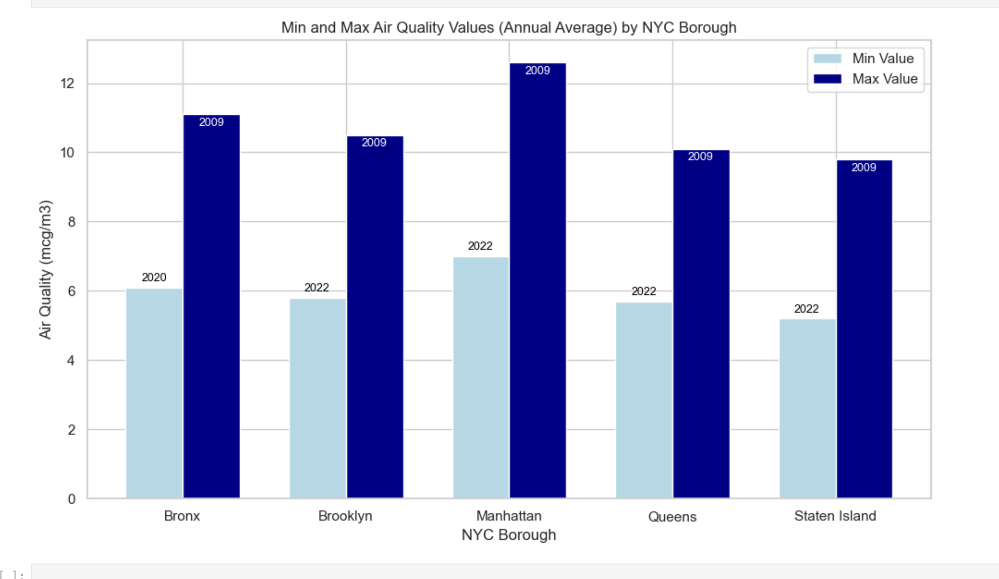

# Air Quality Measurement for New York City

## About the Dataset 

Detailed information about the dataset used for this repo's EDA and Data Visualization can be found in [NYC Open Data](https://data.cityofnewyork.us/Environment/Air-Quality/c3uy-2p5r/about_data).

Dataset contains information on New York City air quality surveillance data.

| Column Name    | Description                                                                                                                                                | API Field Name | Data Type                                                                            |
| -------------- | ---------------------------------------------------------------------------------------------------------------------------------------------------------- | -------------- | ------------------------------------------------------------------------------------ |
| Unique ID      | Unique record identifier                                                                                                                                   | unique_id      | [Text](https://dev.socrata.com/docs/datatypes/text.html)                             |
| Indicator ID   | Identifier of the type of measured value across time and space                                                                                             | indicator_id   | [Number](https://dev.socrata.com/docs/datatypes/number.html)                         |
| Name           | Name of the indicator                                                                                                                                      | name           | [Text](https://dev.socrata.com/docs/datatypes/text.html)                             |
| Measure        | How the indicator is measured                                                                                                                              | measure        | [Text](https://dev.socrata.com/docs/datatypes/text.html)                             |
| Measure Info   | Information (such as units) about the measure                                                                                                              | measure_info   | [Text](https://dev.socrata.com/docs/datatypes/text.html)                             |
| Geo Type Name  | Geography type; UHF' stands for United Hospital Fund neighborhoods; For instance, Citywide, Borough, and Community Districts are different geography types | geo_type_name  | [Text](https://dev.socrata.com/docs/datatypes/text.html)                             |
| Geo Join ID    | Identifier of the neighborhood geographic area, used for joining to mapping geography files to make thematic maps                                          | geo_join_id    | [Text](https://dev.socrata.com/docs/datatypes/text.html)                             |
| Geo Place Name | Neighborhood name                                                                                                                                          | geo_place_name | [Text](https://dev.socrata.com/docs/datatypes/text.html)                             |
| Time Period    | Description of the time that the data applies to ; Could be a year, range of years, or season for example                                                  | time_period    | [Text](https://dev.socrata.com/docs/datatypes/text.html)                             |
| Start_Date     | Date value for the start of the time_period; Always a date value; could be useful for plotting a time series                                               | start_date     | [Floating Timestamp](https://dev.socrata.com/docs/datatypes/floating_timestamp.html) |
| Data Value     | The actual data value for this indicator, measure, place, and time                                                                                         | data_value     | [Number](https://dev.socrata.com/docs/datatypes/number.html)                         |
| Message        | notes that apply to the data value; For example, if an estimate is based on small numbers we will detail here                                              | message        | [Text](https://dev.socrata.com/docs/datatypes/text.html)                             |

 

## Understanding Air Quality Measurement Units

### Concentration Units
- ppb (parts per billion): Measures the number of molecules of a pollutant per billion molecules of air. It's commonly used for gases like ozone, carbon monoxide, and nitrogen dioxide.

- mcg/m³ (micrograms per cubic meter): Represents the mass of a pollutant in micrograms present in one cubic meter of air. It's commonly used for particulate matter (PM2.5 and PM10).

- µg/m³ (micrograms per cubic meter): This is identical to mcg/m³.

### Population-Based Units
- per 100,000 adults: This measures the number of occurrences of a specific air quality event (like asthma attacks or hospitalizations) per 100,000 adults in a population.

- per 100,000 children: Similar to the above, but for children.

- per 100,000: A general category that could refer to adults, children, or a total population.

### Area-Based Unit
- per square mile: This measures the number of occurrences of an air quality event per square mile of area.

### Count Unit
- number: This is a simple count of occurrences without any specific unit of measurement.

 

## Data Visualizations

Both heatmap and animated racing bar chart shows the annual average air quality measurement in mcg/m3 (combined with µg/m³) per NYC borough from 2009-2022. To see the racing bart chart in action right click on `racing_bar_chart.html` folder and select "Open in Default Browser" or visit [https://public.flourish.studio/visualisation/19002062/](https://public.flourish.studio/visualisation/19002062/)

 

The bar chart above illustrates the min and max air quality measurements in mcg/m3 (combined with µg/m³) per NYC borough from 2009-2022.

